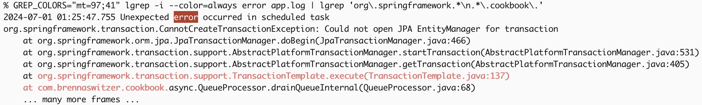

# lgrep

`lgrep` is a `grep`-like utility which better understands log files. Log records in log files often correspond to lines
of text, but not always. Since `grep` only understands lines of text, this can require some gymnastics to extract full
log records.

`lgrep` is not a log _parser_; it merely provides a way to group lines into records. Logs are a common case,
particularly when stack- or back-traces are involved, but any text file can be searched.

## Install

You can grab binaries from the [latest release](https://github.com/barneyb/lgrep/releases/latest), for supported
platforms. Unzip, place on your `$PATH`, and that's it. Otherwise, you'll want to build from source…

## Build & Install

Use `cargo` to build. Get it via http://rustup.rs if you don't have it already.

```
git clone https://github.com/barneyb/lgrep.git
cd lgrep
cargo install --path .
lgrep -h
```

Note that this isn't a "real" installation as a package manager (e.g., `yum` or `homebrew`) would do. It just puts the
binary into Cargo's bin directory (which is on your `$PATH`). In particular, there's no manpage; use `lgrep --help`.

## Options

`lgrep` supports a number of options that `grep` supports, such as `-v` and `-i`. It also supports a few new ones, such
as `--start`, to skip lines in a file until some pattern matches. Use `-h` for a summary, or `--help` for gory detail.

It also supports a subset of GNU `grep`'s `GREP_COLORS` capabilities: `mt`/`ms`, `fn`, `ln`, and `se`. All capabilities
are accepted, any others are simply ignored. Like `grep`, the default is `ms=01;31:fn=35:ln=32:se=36`. For the moment,
only 16-color mode codes are respected.

## Motivation

Consider `app.log`, an 11-line file containing four log records (of one, eight, one, and one lines):

```
% cat app.log
2024-07-01 01:25:46.123 draining queue
2024-07-01 01:25:47.755 Unexpected error occurred in scheduled task
org.springframework.transaction.CannotCreateTransactionException: Could not open JPA EntityManager for transaction
    at org.springframework.orm.jpa.JpaTransactionManager.doBegin(JpaTransactionManager.java:466)
    at org.springframework.transaction.support.AbstractPlatformTransactionManager.startTransaction(AbstractPlatformTransactionManager.java:531)
    at org.springframework.transaction.support.AbstractPlatformTransactionManager.getTransaction(AbstractPlatformTransactionManager.java:405)
    at org.springframework.transaction.support.TransactionTemplate.execute(TransactionTemplate.java:137)
    at com.brennaswitzer.cookbook.async.QueueProcessor.drainQueueInternal(QueueProcessor.java:68)
    ... many more frames ...
2024-07-01 01:25:47.790 queue draining complete (ERROR)
2024-07-01 01:25:48.000 some other unrelated log message
```

If you're `grep`ing for errors, you might try this:

```
% grep -i error app.log
2024-07-01 01:25:47.755 Unexpected error occurred in scheduled task
2024-07-01 01:25:47.790 queue draining complete (ERROR)
```

Hmm... Right records, but not very helpful. How about `-A`:

```
% grep -i -A 5 error app.log
2024-07-01 01:25:47.755 Unexpected error occurred in scheduled task
org.springframework.transaction.CannotCreateTransactionException: Could not open JPA EntityManager for transaction
    at org.springframework.orm.jpa.JpaTransactionManager.doBegin(JpaTransactionManager.java:466)
    at org.springframework.transaction.support.AbstractPlatformTransactionManager.startTransaction(AbstractPlatformTransactionManager.java:531)
    at org.springframework.transaction.support.AbstractPlatformTransactionManager.getTransaction(AbstractPlatformTransactionManager.java:405)
    at org.springframework.transaction.support.TransactionTemplate.execute(TransactionTemplate.java:137)
--
2024-07-01 01:25:47.790 queue draining complete (ERROR)
2024-07-01 01:25:48.000 some other unrelated log message
```

Part of the stack trace is there, but also the unrelated message at the end (and a `--`). What you want is exactly the
matching log records, each one in its entirety, and nothing else. That's `lgrep`:

```
% lgrep -i error app.log
2024-07-01 01:25:47.755 Unexpected error occurred in scheduled task
org.springframework.transaction.CannotCreateTransactionException: Could not open JPA EntityManager for transaction
    at org.springframework.orm.jpa.JpaTransactionManager.doBegin(JpaTransactionManager.java:466)
    at org.springframework.transaction.support.AbstractPlatformTransactionManager.startTransaction(AbstractPlatformTransactionManager.java:531)
    at org.springframework.transaction.support.AbstractPlatformTransactionManager.getTransaction(AbstractPlatformTransactionManager.java:405)
    at org.springframework.transaction.support.TransactionTemplate.execute(TransactionTemplate.java:137)
    at com.brennaswitzer.cookbook.async.QueueProcessor.drainQueueInternal(QueueProcessor.java:68)
    ... many more frames ...
2024-07-01 01:25:47.790 queue draining complete (ERROR)
```

The trick is that log records are clearly identifiable by "starts with a timestamp". `lgrep` uses this to build up a
full log record and then check if it matches the pattern. If it matches, the whole record is printed out. This also
means you can apply multi-line patterns! For example, an error stacktrace where cookbook delegated to Spring (note
the `\n` in the second pattern):

```
% lgrep -i error app.log | lgrep 'org\.springframework.*\n.*\.cookbook\.'
2024-07-01 01:25:47.755 Unexpected error occurred in scheduled task
org.springframework.transaction.CannotCreateTransactionException: Could not open JPA EntityManager for transaction
    at org.springframework.orm.jpa.JpaTransactionManager.doBegin(JpaTransactionManager.java:466)
    at org.springframework.transaction.support.AbstractPlatformTransactionManager.startTransaction(AbstractPlatformTransactionManager.java:531)
    at org.springframework.transaction.support.AbstractPlatformTransactionManager.getTransaction(AbstractPlatformTransactionManager.java:405)
    at org.springframework.transaction.support.TransactionTemplate.execute(TransactionTemplate.java:137)
    at com.brennaswitzer.cookbook.async.QueueProcessor.drainQueueInternal(QueueProcessor.java:68)
    ... many more frames ...
```

May as well abuse color support as well, using background for error and foreground for cookbook-to-Spring:



## Log Format

If your log records don't start with a timestamp, use `--log-pattern` to override the default "start of record" pattern.
Each line of the input which matches the pattern starts a new record. If your application consistently formats its
various logs in a different way, the `LGREP_LOG_PATTERN` environment variable can be used instead of supplying
`--log-pattern` all over the place. The option still takes precedence, for ad hoc use.

Until the log pattern matches the first time `lgrep` will treat each line of text as its own record. This allows using
`lgrep` as a normal `grep` for non-log files. If you have a non-log file which happens to have leading timestamps that
_don't_ indicate log records, pass either `--log-pattern=` so every line is a record, or some other pattern that matches
zero lines.

As a non-log example, print `Cargo.toml` tables (which start with `[name-of-table]`) that reference `shadow-rs`:

```
% lgrep --log-pattern='^\[.+\]' shadow-rs Cargo.toml
[dependencies]
anyhow = "1.0.86"
clap = { version = "4.5.9", features = ["derive"] }
is-terminal = "0.4.12"
regex-automata = "0.4.7"
shadow-rs = "0.30.0"

[build-dependencies]
shadow-rs = "0.30.0"
```

## Compressed Logs

> ⚠️This feature is not available on Windows. You must decompress the logs yourself. If you have a Windows environment
> and know Rust, a PR addressing this would be very welcome!

`lgrep` transparently supports compressed inputs using (de)compression utilities available on your `$PATH`. To
demonstrate, compress `app.log` a couple ways:

```
% gzip -k app.log
% bzip2 -k app.log
% ls -o app.log*
-rw-r--r--  1 barneyb  950 Jul  6 19:29 app.log
-rw-r--r--  1 barneyb  479 Jul  6 19:29 app.log.bz2
-rw-r--r--  1 barneyb  417 Jul  6 19:29 app.log.gz
```

Whether named on the command line or streamed, `lgrep` will treat them equivalently:

```
% lgrep draining app.log
2024-07-01 01:25:46.123 draining queue
2024-07-01 01:25:47.790 queue draining complete (ERROR)
% lgrep draining app.log.gz
2024-07-01 01:25:46.123 draining queue
2024-07-01 01:25:47.790 queue draining complete (ERROR)
% lgrep draining < app.log.bz2
2024-07-01 01:25:46.123 draining queue
2024-07-01 01:25:47.790 queue draining complete (ERROR)
```

## Performance

At my day job, I had an error id (`b2f444a1-918b-4dd7-994f-990097dd4faa`), and needed to get the corresponding stack
trace out of some application logs. The error was known to have occurred on one of six JVMs, and during hour 15 of
2024-07-06. This was my starting point, on an 2019 Intel MBP running macOS Sonoma 14.5:

```
% ls -oh jvm*.gz
-rw-r--r--  1 barneyb    37M Jul  6 19:29 jvm-1.log.2024-07-06-15.gz
-rw-r--r--  1 barneyb    34M Jul  6 19:29 jvm-2.log.2024-07-06-15.gz
-rw-r--r--  1 barneyb    54M Jul  6 19:29 jvm-3.log.2024-07-06-15.gz
-rw-r--r--  1 barneyb    56M Jul  6 19:29 jvm-4.log.2024-07-06-15.gz
-rw-r--r--  1 barneyb    46M Jul  6 19:29 jvm-5.log.2024-07-06-15.gz
-rw-r--r--  1 barneyb    50M Jul  6 19:29 jvm-6.log.2024-07-06-15.gz
```

Let's find that error!

```
% time lgrep b2f444a1-918b-4dd7-994f-990097dd4faa jvm-*.gz
jvm-1.log.2024-07-06-15.gz:... log header omitted ...
jvm-1.log.2024-07-06-15.gz-... stack ...
jvm-1.log.2024-07-06-15.gz-... trace ...
jvm-1.log.2024-07-06-15.gz-... omitted ...
lgrep b2f444a1-918b-4dd7-994f-990097dd4faa jvm-*.gz  7.05s user 1.83s system 171% cpu 5.185 total
```

Turns out it was from `jvm-1`, and got the stack trace, so I'm done. But what about `zgrep`-ing just that one file?

```
% time zgrep b2f444a1-918b-4dd7-994f-990097dd4faa jvm-1.log.2024-07-06-15.gz
... log line omitted ...
zgrep b2f444a1-918b-4dd7-994f-990097dd4faa   10.44s user 0.02s system 99% cpu 10.477 total
```

About double the time for `lgrep` to process _all_ the files?! Maybe it was the lack of parallelism. How does `lgrep`
perform for just one file?

```
% time lgrep b2f444a1-918b-4dd7-994f-990097dd4faa jvm-1.log.2024-07-06-15.gz
... log header omitted ...
... stack ...
... trace ...
... omitted ...
lgrep b2f444a1-918b-4dd7-994f-990097dd4faa   0.90s user 0.21s system 169% cpu 0.652 total
```

So `zgrep` is slow, and `lgrep` can parallelize, even over a single file. What if the log is decompressed ahead of time?

```
% time gunzip jvm-1.log.2024-07-06-15.gz
gunzip jvm-1.log.2024-07-06-15.gz  0.39s user 0.24s system 98% cpu 0.641 total
% time grep b2f444a1-918b-4dd7-994f-990097dd4faa jvm-1.log.2024-07-06-15
... log line omitted ...
grep b2f444a1-918b-4dd7-994f-990097dd4faa   9.99s user 0.08s system 99% cpu 10.071 total
% time lgrep b2f444a1-918b-4dd7-994f-990097dd4faa jvm-1.log.2024-07-06-15
... log header omitted ...
... stack ...
... trace ...
... omitted ...
lgrep b2f444a1-918b-4dd7-994f-990097dd4faa   0.49s user 0.12s system 98% cpu 0.616 total
```

Looks like it's actually `grep` that is slow, and `lgrep` parallelizes between decompression and searching. The
decompression overhead is about half a second for both `lgrep` and `zgrep`, which approximates `gunzip`'s runtime.

A quick comparison, not a formal benchmark, but fairly suggestive nonetheless.
